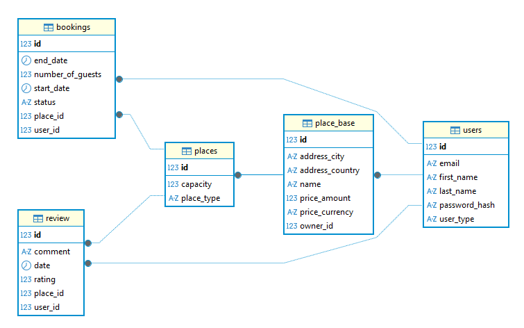

# 🏨 IronBooking

## 📌 Description of the Project

**IronBooking** is a Spring Boot-based backend web application designed to manage bookings and reviews for a variety of 
rentable spaces, including apartments, offices, houses, and studios. The system allows two types of users: **owners**, who list and manage their properties, and **clients**, who browse available spaces and make reservations.

The application provides endpoints for creating and managing places, handling user registration, and submitting reviews. It was developed as part of Ironhack's **Module 2 – Homework 3**, with a strong focus on backend architecture, RESTful API design, and testing best practices using Java and Spring Boot.

> This project does not include a frontend interface and is intended to serve as the backend foundation for future integration.

---

## 📐 Class Diagram


> This diagram was generated using DBeaver's ER visualization tool and reflects the relationships between entities 
> such as User, Place, Booking and Review.
---

## 🚀 Setup Requirements

Make sure you have the following installed:

- Java 17+
- Maven
- MySQL (or your preferred RDBMS)
- DBeaver (for database management)
- Postman (for API testing)

---
## 📦 Setup

To run the project locally:

```bash
# Clone the repository
git clone https://github.com/AidaG91/IronBooking.git

# Navigate into the project directory
cd IronBooking

# Build the project and install dependencies
mvn clean install

# Run the application
mvn spring-boot:run
```
---
## 🧰 Technologies Used

**Backend & Frameworks**
- Java 17
- Spring Boot
- Spring Data JPA
- Hibernate

**Database & Persistence**
- MySQL
- Jakarta Validation
- Lombok

**Testing**
- JUnit 5
- Mockito
- MockMvc

**API & Documentation**
- Swagger (OpenAPI)

**Build & Dependency Management**
- Maven

**Development Tools**
- IntelliJ IDEA (recommended IDE)
- DBeaver (for database inspection)
- Postman (for API testing)

---

## 🧭 Controllers and Routes Structure

| Controller         | Route Prefix       | Description                                                                 |
|--------------------|--------------------|-----------------------------------------------------------------------------|
| `UserController`    | `/users`           | User registration, profile management, search by email/type, user bookings |
| `PlaceController`   | `/places`          | CRUD operations for places, filter by type, city, country, capacity, owner |
| `ReviewController`  | `/reviews`         | Create, update, delete reviews, get by ID or user ID                        |
| `BookingController` | `/bookings`        | Create, update, delete bookings, get by ID or status, list all bookings    |

> All controllers follow RESTful conventions and use DTOs for request/response encapsulation.


---

## 🔗 Extra Links

- [GitHub Projects - Kanban](https://github.com/users/AidaG91/projects/2)
- [Presentation Slides](https://gamma.app/docs/IronBooking-0g4h40i8jo3wh2z?mode=doc)

---

## 🚀 Future Work

- Add authentication and role-based access (JWT)
- Implement pagination for reviews and places
- Add image upload for places
- Improve error handling with custom exceptions
- Frontend integration
- Add filters for city, price range, and accommodation type
- Implement availability calendar for bookings
- Create a favorites system for users
- Enable email notifications (for advanced features)
---
## 👥 Team Members
This project was developed collaboratively by a team of Ironhack students. Each member contributed across different areas including backend logic, testing, and documentation.
- [Kiko](https://github.com/krub-dev)
- [Ilia](https://github.com/iyasyr)
- [Luis](https://github.com/iamluismoran)
- [Lucía](https://github.com/Lucintheskies)
- [Aïda](https://github.com/AidaG91)
